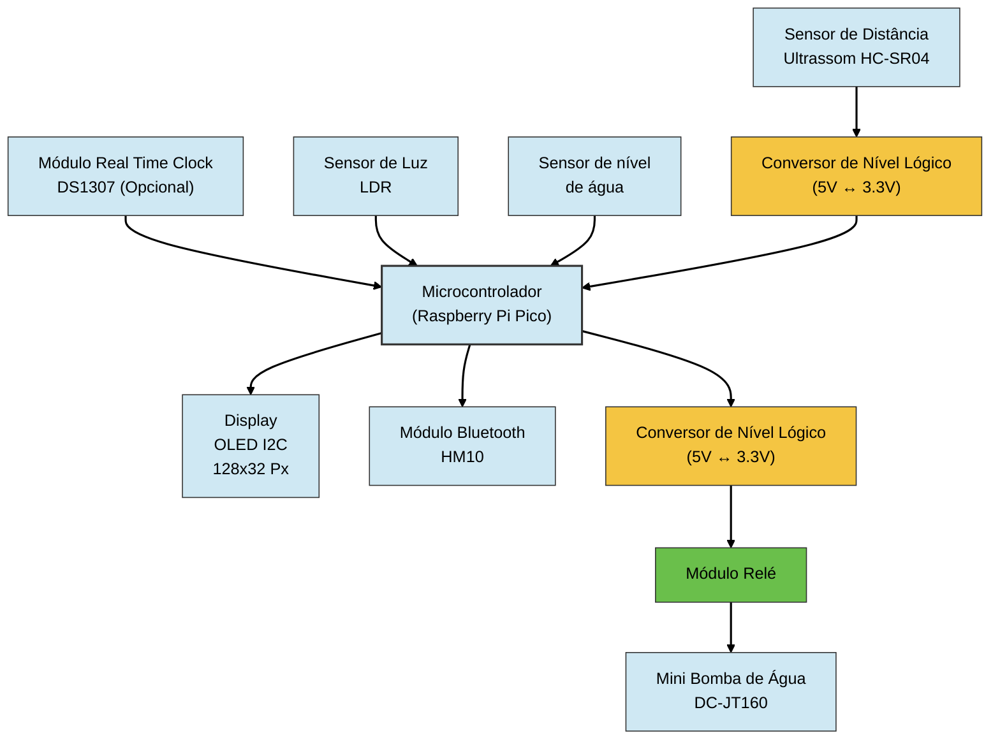
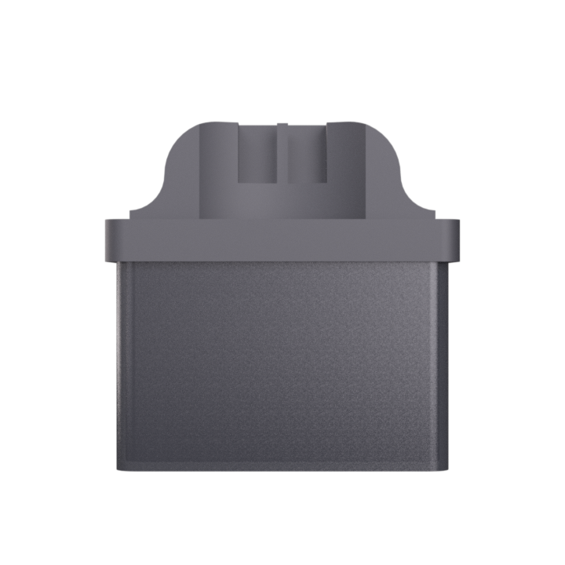
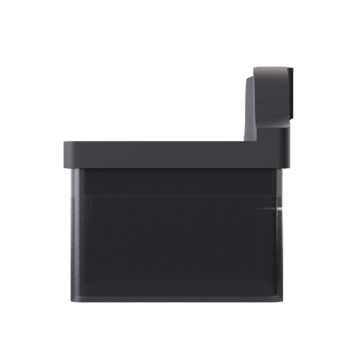
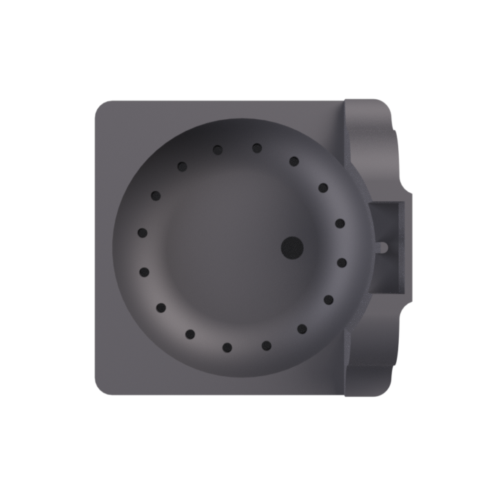
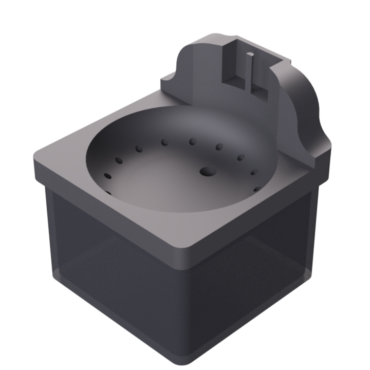

# Bebedouro Inteligente para Pets

## Integrantes do Grupo:
- Diego Mourão Oliveira
- Ilan Hameiry
- Luca Lopes Martinho

## Descrição do Projeto

O projeto consiste no desenvolvimento de um dispositivo IoT voltado para o fornecimento de água corrente para animais de estimação (pets), com foco em uso residencial.

O objetivo principal é oferecer uma forma mais atrente e confortável de hidratação para o animal, simulando o fluxo de água corrente, além de monitorar a frequência com que o pet utiliza o bebedouro.

O sistema será ativado automaticamente apenas quando houver presença do animal próxima ao dispositivo, evitando desperdício de energia e água.

## Funcionamento do Sistema

O bebedouro funcionará em ciclo contínuo de circulação de água entre a bomba e o reservatório, simulando água corrente.

Por meio de um sensor de presença por distância (ultrassônico), o sistema será ativado automaticamente quando o animal se aproximar.

Após a detecção, o dispositivo permanecerá ligado por alguns segundos mesmo após a ausência de presença, garantindo tempo suficiente para o pet se hidratar.

Além disso, o sistema contará com:

- Iluminação interna por LEDs, acionada automaticamente quando a luminosidade do ambiente estiver baixa;
- Display informativo com dados importantes de uso;
- Monitoramento do nível de água no reservatório;
- Alertas de nível baixo de água;
- Botão de ativação manual;
- Botão de reset do sistema;
- Envio de notificações e informações para um software externo via Bluetooth.

## Objetivos do Projeto

- Melhorar a experiência de hidrtação dos pets;
- Automatizar o fornecimento de água;
- Reduzir desperdícios de energia e água;
- Permitir o monitoramento do uso do bebedouro;
- Fornecer alertas e informações em tempo real ao usuário.

## Requisitos do Sistema

### Requisitos Obrigatórios

| ID | Requisito | Tipo |
|---|---|---|
| RO-01 | Água circulando entre bomba e funil | Obrigatório |
| RO-02 | Detector de presença por distância (sensor ultrassônico) | Obrigatório |
| RO-03 | Iluminação em LED quando necessário | Obrigatório |
| RO-04 | Botão para ativação manual | Obrigatório |
| RO-05 | Botão de reset | Obrigatório |

### Requisitos Desejáveis

| ID | Requisito | Tipo |
|---|---|---|
| RD-01 | Display com informações úteis de uso: nível de água e número de ativações | Desejável |
| RD-02 | Mensagem via Bluetooth quando houver presença detectada ou nível baixo de água | Desejável |
| RD-03 | Sensor de nível de água | Desejável |

### Requisitos Opcionais

| ID | Requisito | Tipo |
|---|---|---|
| ROP-03 | Programação de ativação em intervalos de tempo definidos | Opcional |

## Diagrama de Blocos

## Softwares Utilizados

Durante o desenvolvimento do projeto foram utilizados os seguintes softwares:

- KiCad — utilizado para esquematização eletrônica e desenvolvimento do diagrama/layout da PCB;
- Thonny — utilizado para programação, testes e depuração do Raspberry Pi Pico;
- Autodesk Fusion 360, Solidworks — utilizados para modelagem 3D da estrutura do bebedouro;

## Tecnologias Envolvidas

O projeto utiliza conceitos de:

- Internet das Coisas (IoT)
- Sensores ultrassônicos
- Sensores de nível de água
- Iluminação automatizada com LEDs
- Comunicação via Bluetooth
- Sistemas embarcados
- Automação residencial

## Imagens do Modelo

 
 

